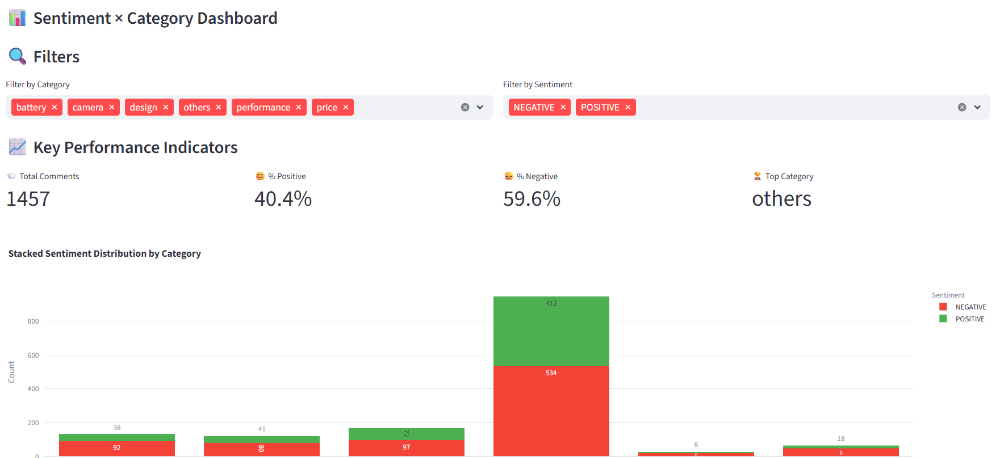

# Product Feedback Analyzer

**"Get unfiltered customer opinions on your product — instantly."**

The **Product Feedback Analyzer** is an intelligent web app built with **Streamlit** and **Transformers**.  
It helps you analyze customer reviews or YouTube comments, automatically detecting both the **sentiment** (positive/negative) and **product feature categories** (e.g., Price, Battery, Camera, etc.).  

## Live Demo

**Try the app live:**  
👉 [https://dooinn-product-feedback-analyzer-app-7vfoe0.streamlit.app/](Try it here!!)

Test the app using the test dataset (test.csv) and gather insights!




## Installation Guide

### Clone the Repository

```bash
git clone https://github.com/dooinn/product_feedback_analyzer.git
cd product_feedback_analyzer
```

### Create and Activate Virtual Environment

```bash
python -m venv venv
source venv/bin/activate      # On Mac/Linux
venv\Scripts\activate         # On Windows
```

### Install Dependencies
```bash
pip install -r requirements.txt
```


### Run the App
```bash
streamlit run app.py
```

## Run with Docker (Recommended)

### Pull the Docker Image
```bash
docker pull dooinn/feedback-app:latest
```

### Run the Container
```bash
docker run -p 8501:8501 dooinn/feedback-app:latest
```

The app will be available at: http://localhost:8501

